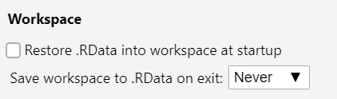

### Getting Started with Markdown

- Download Zipped R project 

- Open Zipped folder and copy internal folder (R Project) to a BUA 345 folder on your computer NOT IN DOWLOADS

- Click on .Rproj file to open project

- Click on `code_data_output` file to open it.

- Click on `BUA_345_Lecture_10.Rmd` to open it.

- Run Setup Chunk.

---

### Setup

- The setup chunk shows the packages needed for this demo.   

- R will install specified packages if needed (only required once after R is installed)  

- R will load specified packaged (required every time you start a new R session)  

- The first time you run this code, R will install these packages which will be slow.  

- **If you get warnings, that's okay.**  

- If you get **error messages**, I (or TA), can help you.

---

### Setup Chunk for Lecture 11

```{r setup for Lecture 11, include = T}


# this line specifies options for default options for all R Chunks
knitr::opts_chunk$set(echo=T, highlight=T)

# suppress scientific notation
options(scipen=100)

# install helper package that loads and installs other packages, if needed
if (!require("pacman")) install.packages("pacman", repos = "http://lib.stat.cmu.edu/R/CRAN/")

# install and load required packages
pacman::p_load(pacman,tidyverse, magrittr, olsrr, gridExtra)

# verify packages
p_loaded()

```

---

---

### Multiple Linear Regression (MLR) in R

- Extending this model to Multiple Linear Regression is straightforward.
- Additional terms are added to the model with a `+` sign between them:
- MLR model for houses data:


```{r mlr review question}

# import dataset 
# save it as an object named houses
houses <- read_csv("houses.csv", show_col_types=F) 

# mlr model with living area, bathrooms and house age in model
(houses_mlr <- ols_regress(Selling_Price ~ Living_Area + Bathrooms + House_Age, data = houses))

```

---

### Lecture 11 In-class Exercises

#### **Question 1 (L11) - Session ID: bua345s23**  

**Assuming number of bathrooms and age of a house are unchanged, what would be the CHANGE in price due *SOLELY to building an addition that adds 300 square feet to the living area?***   
 
**Round answer to closest thousand dollars (K)**

HINT: Multiply coefficient for Living Area by 300 and round to closest thousand

A. 14 K  
B. 16 K  
C. 18 K  
D. 20 K  
E. 22 K  

#### Two ways to save a value from a model

```{r calculating change in y, eval = F}

b_lvng_area <- 60.614                     # type value manually
b_lvng_area <- houses_mlr$betas[2]        # use stored betas vector (more advanced, NOT required)
(b_lvng_area*300) |> round(-3)            # answer to question

```

---


### Helpful RStudio Changes


- To change appearance or other options:

  - Windows OS: Tools > Global Options
  - Mac OS: RStudio > Preferences

- One very useful change (Do now):

  - Change 'Save workspace...' option to Never
  
<br><center>



</center><br>

- Changing Appearance (Optional but helpful)

  - Within same Menu, click Appearance - Many options to examine

- Other options - Everything can be changed, but I like most of the defaults

  - Source vs. Visual (I prefer Source)

    - **Visual** version is newer and easier to read, glitchy but improving with each version
    -   Slides and abridged HTML notes will **ALWAYS** be provided.

---

### Quick Review of Correlation Matrices, SLR, and MLR


#### Importing Data using `read_csv`

- **Recall how to import data from our project using `read_csv`:**


```{r import houses data}
# import dataset 
# save it as an object named houses
houses <- read_csv("houses.csv", show_col_types=F) 

```


- Notice that the data now appear in the `Global Environment` (Upper Right Pane).

- You can click on the dataset name to view it.

---

### Examining Data using `glimpse`

- You can also examine the data using the R command `glimpse`
  
- A **very** nice feature of R Markdown is that output from commands appears directly below the R Chunk.

- Submitted commands AND output also appear in the Console (Lower Left Pane).

<br>

```{r examine data using glimpse}

# houses data is piped (sent into) the glimpse() command
houses |> glimpse() 

```

---

### Examining Data using a Correlation Matrix

Now we can calculate the correlation matrix of these data using the `cor` command:

<br>

```{r correlation matrix of houses data}
# correlation matrix is printed to screen but not saved
# correlation values are rounded to two decimal places
houses |> cor() |> round(2) 

```

<br>

- The correlation matrix shows the correlation, R<sub>XY</sub>, between each pair of variables in the data.

- Values along the diagonal are 1 because that shows the correlation between each variable and itself.

---

### saving a Correlation Matrix

-   We can also save that matrix **AND** print to the screen:

```{r saving and printing the correlation matrix}
# saved object can be printed to screen by enclosing it in parentheses
# correlation matrix saved as cor_houses_data
(cor_houses_data <- houses |> cor() |> round(2))  
```

-  If you save an object and want to view it later, type it's name and hit enter:

```{r printing a saved object to the screen}
cor_houses_data # type name of any saved object to view it on screen
```

---

### Lecture 11 In-class Exercises

#### **Question 2 (L11) - Session ID: bua345s23**  

**What is the correlation between House_Age and Bathrooms (number of bathrooms) in this dataset?**

A.  0.77

B.  0.71

C.  0.66

D.  -0.22

E.  -0.38

F.  -0.52

---

### R code to create and view a MLR model

```{r slr houses model}
# slr model with just living area
(houses_slr <- ols_regress(Selling_Price ~ Living_Area, data = houses))

```


---

### Multiple Linear Regression (MLR) in R

- Extending this model to Multiple Linear Regression is straightforward.
- Additional terms are added to the model with a `+` sign between them:
- MLR model for houses data:


```{r mlr houses model}

# mlr model with living area, bathrooms and house age in model
(houses_mlr <- ols_regress(Selling_Price ~ Living_Area + Bathrooms + House_Age, data = houses))

```


---


