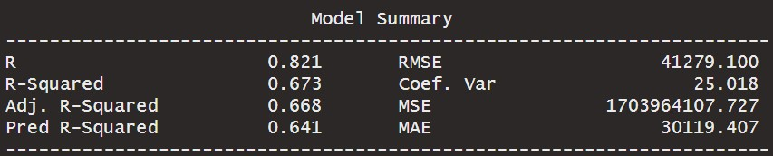
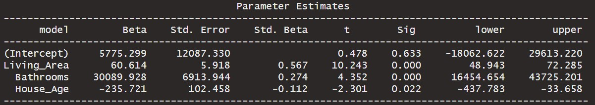
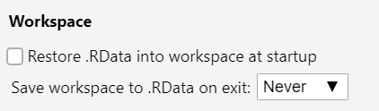
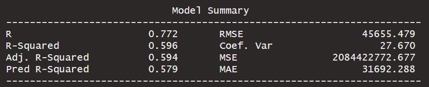
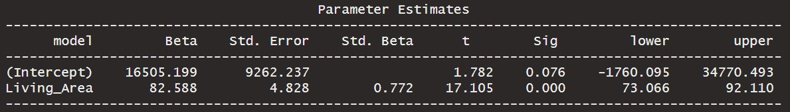

```{r setup, include=FALSE, echo=FALSE}
options(htmltools.dir.version = FALSE)
knitr::opts_chunk$set(
  fig.retina=2,
  #out.width = "75%",
  #out.height = "50%",
  htmltools.preserve.raw = FALSE,      # needed for windows
  scipen=100,                          # suppresses scientific notation
  getSymbols.warning4.0 = FALSE,       # suppresses getSymbols warnings
  cache = FALSE,
  echo = TRUE,
  hiline = TRUE,
  message = FALSE, 
  warning = FALSE
)


# install helper package (pacman)
# pacman loads and installs other packages, if needed
if (!require("pacman")) install.packages("pacman", repos = "http://lib.stat.cmu.edu/R/CRAN/")

# install and load required packages
# pacman should be first package in parentheses and then list others
pacman::p_load(pacman, tidyverse, gridExtra, magrittr, tools)

# verify packages (comment out in finished documents)
p_loaded()


```

```{r xaringan-themer, include=FALSE, warning=FALSE}
library(xaringanthemer)

palette <- c(
  SU_Orange1        = "#F76900",
  SU_Orange2        = "#FF8E00",
  SU_Red_Orange     = "#FF431B",
  SU_Blue1          = "#000E54",
  SU_Blue2          = "#203299",
  SU_Light_Blue     = "#2B72D7",
  SU_White          = "#FFFFFF",
  SU_Light_Gray     = "#ADB3B8",
  SU_Medium_Gray    = "#707780",
  SU_Black          = "#000000", 
  
  steel_blue        = "#4682B4",
  corn_flower_blue  = "#6495ED",
  deep_sky_blue     = "#00BFFF",
  dark_magenta      = "#8B008B",
  medium_orchid     = "#BA55D3",
  lime_green        = "#32CD32",
  light_sea_green   = "#20B2AA",
  chartreuse        = "#7FFF00",
  orange_red        = "#FF4500",
  white_smoke       = "#F5F5F5",
  dark_cyan         = "#008B8B",
  light_steel_blue  = "#B0C4DE",
  indigo            = "#4B0082",
  ivory             = "#FFFFF0",
  light_slate_grey  = "#778899",
  linen             = "#FAF0E6",
  steel_blue        = "#4682B4",
  blue_violet       = "#8A2BE2",
  dodger_blue       = "#1E90FF",
  light_blue        = "#ADD8E6",
  azure             = "#F0FFFF",
  lavender          = "#E6E6FA")

primary_color = "#4682B4"                # steel_blue
secondary_color = "#778899"              # light_slate_grey
white_color = "#FFFFF0"                  # ivory
black_color = "#000080"                  # navy

style_duo_accent(
  primary_color = primary_color,
  secondary_color = secondary_color,
  white_color = white_color,
  black_color = black_color,
  text_color = black_color,
  header_color = primary_color,
  background_color = white_color,
  code_inline_background_color = "#E6E6FA", # lavender
  link_color = "#1E90FF",                   # dodger_blue
  code_inline_color = "#4B0082",            # indigo
  text_bold_color = "#8B008B",              # dark_magenta
  header_font_google = google_font("Open Sans"),
  text_font_google = google_font("Open Sans"),
  code_font_google = google_font("Source Code Pro"),
  colors = palette
)


```

```{r xaringan-panelset, echo=FALSE}
xaringanExtra::use_panelset()
```

```{r xaringan-tile-view, echo=FALSE}
xaringanExtra::use_tile_view()
```

```{r xaringan-fit-screen, echo=FALSE}
xaringanExtra::use_fit_screen()
```

```{r xaringan-tachyons, echo=FALSE}
xaringanExtra::use_tachyons()
```

```{r xaringan-animate-css, echo=FALSE}
xaringanExtra::use_animate_css()
```

```{r xaringan-animate-all, echo=FALSE}
#xaringanExtra::use_animate_all("slide_up")
```

background-image: url("docs_files/images/sloth_faded.png")
background-size: cover

class: bottom, right

## BUA 345 - Lecture 11

### More about Correlation, SLR, and MLR in R

<br>


#### Penelope Pooler Eisenbies

#### `r Sys.Date()`

[Wikipedia Sloth Page](https://en.wikipedia.org/wiki/Sloth)

---

### Two options for using the Lecture 11 Markdown (.Rmd) file: 

#### Option 1: If you were not able to use R/Rstudio to run code on Tuesday:

1. Download Updated Zipped R project. 

2. Open Zipped folder.

3. Copy internal folder (R Project) to a BUA 345 folder on your computer **NOT IN DOWLOADS**.

4. Click on .Rproj file to open project.

5. Open `code_data_output` folder in files pane (lower left pane).

6. Notice there are now ***TWO*** .Rmd files, one Lecture 10 and one for Lecture 11.

7. Open `BUA_345_Lecture_11.Rmd` file.

8. Run Setup chunk.

---

### Two options for using the Lecture 11 Markdown (.Rmd) file:  

#### Option 2: If you opened the Lecture 10 Markdown file and made changes already:

1. Download `BUA_345_Lecture_11.Rmd` Markdown file from Blackboard (Lecture 11).

2. Save this .Rmd file to the `code_data_output` in the Lecture 10 R project on your computer.

3. Open `BUA_345_Lecture_11.Rmd` file.

4. Run Setup chunk.

5. **Optional:** 

   - Rename folder to be `BUA 345 Lectures 10 & 11 R Project`

   - Rename .Rproj file to be `BUA 345 Lectures 10 & 11 R Project`

---

### Setup

.pull-left[

- The setup chunk shows the packages needed for this demo.   

- R will install specified packages if needed (only required once after R is installed)  

- R will load specified packaged (required every time you start a new R session)  

- The first time you run this code, R will install these packages which will be slow.  

- **If you get warnings, that's okay.**  

- If you get **error messages**, I (or TA), can help you.

]

.pull-right[


]


---

### Setup Chunk for Lecture 11

```{r setup for Lecture 11, include = T}


# this line specifies options for default options for all R Chunks
knitr::opts_chunk$set(echo=T, highlight=T)

# suppress scientific notation
options(scipen=100)

# install helper package that loads and installs other packages, if needed
if (!require("pacman")) install.packages("pacman", repos = "http://lib.stat.cmu.edu/R/CRAN/")

# install and load required packages
pacman::p_load(pacman,tidyverse, magrittr, olsrr, gridExtra)

# verify packages
p_loaded()

```


**NOTES:

- ** Don't worry about `xaringanthemer` package.  That is required for my slides but not for your code.

- I have added one more package, `gridExtra`, that you will need for the optional plot demo in your HW 5.

---

### Multiple Linear Regression (MLR) in R

- Extending this model to Multiple Linear Regression is straightforward.
- Additional terms are added to the model with a `+` sign between them:
- MLR model for houses data:


```{r mlr review question, eval=F}

# mlr model with living area, bathrooms and house age in model
(houses_mlr <- ols_regress(Selling_Price ~ Living_Area + Bathrooms + House_Age, data = houses))

```

#### Abridged MLR Output:

```{r echo=F}





```

---

### Lecture 11 In-class Exercises

#### **Question 1 (L11) - Session ID: bua345s23**  

**Assuming number of bathrooms and age of a house are unchanged, what would be the CHANGE in price due *SOLELY to building an addition that adds 300 square feet to the living area?***   
 
**Round answer to closest thousand dollars (K)**

HINT: Multiply coefficient for Living Area by 300 and round to closest thousand

A. 14 K  
B. 16 K  
C. 18 K  
D. 20 K  
E. 22 K  

#### Two ways to save a value from a model

```{r calculating change in y, eval = F}

b_lvng_area <- 60.614                     # type value manually
b_lvng_area <- houses_mlr$betas[2]        # use stored betas vector (more advanced, NOT required)
(b_lvng_area*300) |> round(-3)            # answer to question

```

---

### Plan for Today

#### 1. Review materials from MAS 261 and Khan Academy

- On Blackboard I have created a [Review Materials]() section.

  - Relevant Lectures and Videos from MAS 261 are posted:

     - Lecture 13 - One Sample Hypothesis Tests
     - Lecture 19 - Linear Transformations
     - Lecture 20 - Multiple Linear Regression
  
  - Also posted: Two Khan Academy links about hypothesis testing:
     
     - Hypothesis Tests: The Idea of Significance Tests
     - Comparing a P-value from a test statistic to a Significance Level


#### 2. Continue with Correlation SLR and MLR models in R

#### 3. Work through some of HW 5 and help students with R/RStudio part of assignment

---

### Technical issues with R and RStudio

.pull-left[

- Many students have gotten some help and are now able to use R and RStudio

- I also received some excellent questions which I will mention today.

- If you still need help, beyond the time available in class:

  - It is your responsibility to come to office hours or make an appointment.
  
  - R/RStudio will be required in assignments, Quiz 2, and Final exam

- Learning new software and coding language can be stressful, but we can help you

]


.pull-right[


]


---

### Helpful RStudio Changes

.pull-left[

- To change appearance or other options:

  - Windows OS: Tools > Global Options
  - Mac OS: RStudio > Preferences

- One very useful change (Do now):

  - Change 'Save workspace...' option to Never

]


.pull-right[


```{r echo=F, out.height=150, out.width=600, out.extra='style="background-color: #202020; padding:1px; display: inline-block;"'}



```


]

<br>

- Changing Appearance (Optional but helpful)

  - Within same Menu, click Appearance - Many options to examine

- Other options - Everything can be changed, but I like most of the defaults

  - Source vs. Visual (I prefer Source)

    - **Visual** version is newer and easier to read, glitchy but improving with each version
    -   Slides and abridged HTML notes will **ALWAYS** be provided.
    
---

### Quick Review of Correlation Matrices, SLR, and MLR

.pull-left[

#### Importing Data using `read_csv`

<br>

- **Recall how to import data from our project using `read_csv`:**

<br>

```{r import houses data}
# import dataset 
# save it as an object named houses
houses <- read_csv("houses.csv", 
                   show_col_types=F) 
```

<br>

- Notice that the data now appear in the `Global Environment` (Upper Right Pane).

- You can click on the dataset name to view it.

]

.pull-right[


]


  
  
---

### Examining Data using `glimpse`

- You can also examine the data using the R command `glimpse`
  
- A **very** nice feature of R Markdown is that output from commands appears directly below the R Chunk.

- Submitted commands AND output also appear in the Console (Lower Left Pane).

<br>

```{r examine data using glimpse}

# houses data is piped (sent into) the glimpse() command
houses |> glimpse() 
```

---

### Examining Data using a Correlation Matrix

Now we can calculate the correlation matrix of these data using the `cor` command:

<br>

```{r correlation matrix of houses data}
# correlation matrix is printed to screen but not saved
# correlation values are rounded to two decimal places
houses |> cor() |> round(2) 
```

<br>

- The correlation matrix shows the correlation, R<sub>XY</sub>, between each pair of variables in the data.

<br>

- Values along the diagonal are 1 because that shows the correlation between each variable and itself.

---

### saving a Correlation Matrix

-   We can also save that matrix **AND** print to the screen:

```{r saving and printing the correlation matrix}
# saved object can be printed to screen by enclosing it in parentheses
# correlation matrix saved as cor_houses_data
(cor_houses_data <- houses |> cor() |> round(2))  
```

-  If you save an object and want to view it later, type it's name and hit enter:

```{r printing a saved object to the screen}
cor_houses_data # type name of any saved object to view it on screen
```

---

### Lecture 11 In-class Exercises

#### **Question 2 (L11) - Session ID: bua345s23**  

**What is the correlation between House_Age and Bathrooms (number of bathrooms) in this dataset?**

A.  0.77

B.  0.71

C.  0.66

D.  -0.22

E.  -0.38

F.  -0.52

---

### R code to create and view a MLR model

```{r slr houses model, eval=F}
# slr model with just living area
(houses_slr <- ols_regress(Selling_Price ~ Living_Area, data = houses))

```

#### Abridged SLR Output:

```{r echo=F}





```

---

### Multiple Linear Regression (MLR) in R

- Extending this model to Multiple Linear Regression is straightforward.
- Additional terms are added to the model with a `+` sign between them:
- MLR model for houses data:


```{r mlr houses model, eval=F}

# mlr model with living area, bathrooms and house age in model
(houses_mlr <- ols_regress(Selling_Price ~ Living_Area + Bathrooms + House_Age, data = houses))

```

#### Abridged MLR Output:

```{r echo=F}


```

---

### Help with R/RStudio and HW 5

.pull-left[

- If you have made changes to your Lecture 11 R Markdown file, `BUA_345_Lecture_11.Rmd`, save them now.

- Then close this project.

- I want to make sure everyone can open the HW Assignment 5 R Project on their computer.

- I will walk you through the steps and we do some of the HW questions as in-class exercises.

]

.pull-right[


]


---

background-image: url("docs_files/images/tired_panda_faded.png")
background-size: cover

.pull-left[

### **Key Points from This Week**

.bg-azure.b--dark_cyan.ba.bw2.br3.shadow-5.ph2[

#### Concepts Covered:

- Using R and RStudio 
- Opening R Projects
- Running setup to install and load required R packages
- Importing and Examining Data
- Calculating data summaries and correlations
- Running SLR and MLR models and examining output

#### Additional Related Concepts:

- Document each step and add comments to script
- R Markdown is great for saving code and output in one file

]

]

.pull-right[

.bg-azure.b--dark_cyan.ba.bw2.br3.shadow-5.ph3[
You may submit an 'Engagement Question' about each lecture until midnight on the day of the lecture. **A minimum of four submissions are required during the semester.**
]

]


  


